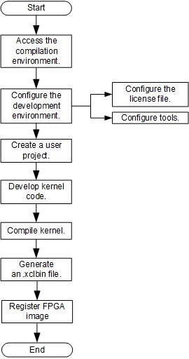
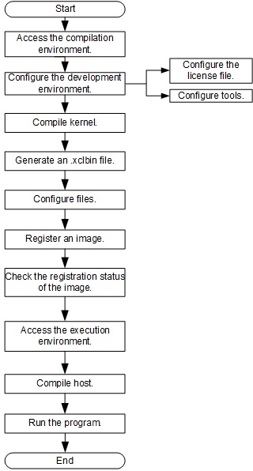

# fp1 Development Suite Description

---

## Contents
-------
1. [fp1 Development Suite](#sec-1)
2. [Directory Structure](#sec-2)
3. [Contents Description](#sec-3)
4. [FPGA Development Guide for General-Purpose Architecture](#sec_3)
   * [4.1 Hardware Development Process](#sec_3_1)
   * [4.2 Software Development Process](#sec_3_2)
   * [4.3 Using an SDAccel-Based Example](#sec_3_3)

The dependency of the development suite on the user server is as follows:

| Type                                  | Description                              |
| ------------------------------------- | ---------------------------------------- |
| Operating system                      | Linux centos 7.3                         |
| Memory                                | >=37GByte                                |
| Hard disk                             | Before installing the SDx tool >=100GByte |
| The installation path of the SDx tool | must be installed in the /software directory |
| license feature                       | (1) XCVU9P, (2) PartialReconfiguration, (3) Simulation 1735 Version 2, (4) xcvu9p_bitgen, (5) ap_opencl |
| SDx tool version                      | 2017.4.op                                |

# 1 fp1 Development Suite

---

**fp1** is an open-source and cloud-based FPGA hardware/software development tool suite based on FACS. This suite helps users to design, simulate, implement, and jointly run FPGA, and provides professional design and verification components to help users to efficiently implement FPGA development.

**fp1** provides tools for **hardware** (**HDK**) and **software** (**SDK**) development respectively. The HDK provides all designs and scripts for RTL (Verilog/VHDL) designing, verifying, and building. The SDK provides FPGA example running environment, drivers, tools, and applications.

# 2 Directory Structure

---

- **fp1/**
  - [hardware/](#sec-3-1)
  - [software/](#sec-3-2)
  - [tools/](#sec-3-3)
  - [docs/](#sec-3-4)
  - [release_notes.md](#sec-3-5)
  - [setup.cfg](#sec-3-8)
  - [setup.sh](#sec-3-9)
  - [FAQs.md](#sec-3-10)

# 3 Contents Description

---

- hardware

  This directory stores fp1 hardware development suite, including SDAccel tools. SDAccel supports C, C++, and OpenCL for development.

  For details, see [hardware README](./hardware/README.md).

- software

  This directory stores fp1 software development suite, including example running environment, drivers, tools, and applications.

  For details, see [software README](./software/README.md).

- tools

  This directory stores tools for fp1 FPGA development.

- docs

  This directory stores FPGA development suite guides, including hardware development process and example operation instructions.

- release_note.md

  This document provides fp1 operation instructions, including project building, user simulation, and application tests.

- setup.cfg

  This user configuration file stores license configurations and SDx version configurations.

- setup.sh

  This script is used to configure environment variables. Run this script before using the development suite.

- FAQs

  This document describes the frequently asked questions (FAQs) and high-risk operations.

  

# 4 FPGA Development Guide for General-Purpose Architecture
When a general-purpose architecture is used, the FPGA development is divided to three scenarios: hardware development, software development, and example using. During hardware development, you can generate and register an FPGA image by using the SDAccel tools. During software development, you can develop applications based on the existing FPGA image. By using examples, you can quickly master the FPGA development process under the current server architecture.

+ [4.1 Hardware Development Process](#sec_3_1)
+ [4.2 Software Development Process](#sec_3_2)
+ [4.3 Using an SDAccel-Based Example](#sec_3_3)

## 4.1 Hardware Development Process

> If the kernel compilation has been implemented offline , and the corresponding xclbin file generation is done, please refer to the link as [SDAccel-based offline development online usage process description](./docs/SDAccel-based_offline_development_online_use_process_guidance.md).

When a general-purpose architecture is used, the hardware development is based on the SDAccel tools. This development process guides users to create, compile, and simulate a project, generate an .xclbin file, and register an FPGA image (AEI, Accelerated Engine Image). After the hardware development, if you need to develop your own applications based on the registered FPGA image, see section [4.2](#sec_3_2).

### 4.1.1 Generating an .xclbin File
For details about how to develop an .xclbin file based on the SDAccel, see [Implementation_Process_of_SDAccel_based_Hardware_Development](./docs/Implementation_Process_of_SDAccel_based_Hardware_Development.md).

### 4.1.2 Registering an FPGA Image
Before registering an FPGA image, if you have not installed this tool yet, please install the image management tool fisclient. After the installation, you can use AEI_Register.sh to register an FPGA image with the image management module. For details about how to register an FPGA image, see [Registering an FPGA Image](./docs/Register_an_FPGA_image_for_an_OpenCL_project.md). After the registration, an ID is assigned to the FPGA image. Please record this ID, because it can be used to query the registration status, and load, delete, and associate the image.

## 4.2 Software Development Process

After hardware development and FPGA image registration, you can develop FPGA user applications by referring to this section.

### 4.2.1 Compiling and Debugging User Applications
The general-purpose architecture development mode uses the Xilinx SDAccel architecture to exchange data between the FPGA and the processors. For details about how to compile and debug user applications, see [SDAccel-Based User Applications Development Description](./software/app/sdaccel_app/README.md).
If you need to modify the HAL, see the [SDAccel Mode HAL Development Description](./software/userspace/sdaccel/README.md).

### 4.2.2 Running User Applications

After the FPGA image loading and application compilation, you can go to the `huaweicloud-fpga/fp1/software/app/sdaccel_app`directory to run user applications.

## 4.3 SDAccel-Based Example
When a general-purpose architecture is used, the Huawei FAC services provide three examples.  Example 1 is an example of matrix multiplication using C to implement the logic algorithm. Example 2 is an example of vector addition using OpenCL C to implement the logic algorithm.Example 3 is an example of vector addition using RTL to implement the logic function. The following figure shows the SDAccel-based example operation process.

For details, see [Using an SDAccel-Based Example](./docs/Using_an_SDAccel_based_Example.md).
