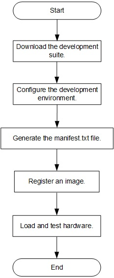

Using OTC Cloud Based on Offline SDAccel Development
=======================


**Prerequisites** 
You have implemented the kernel compilation offline and generated an .xclbin file.

Contents
-------------------------

[Overall Operation Process](#sec-1)

[Downloading the Development Suite](#sec-2)

[Configuring the Development Environment](#sec-3)

[store the .xclbin file](#sec-4)

[Registering an Image](#sec-5)

[Loading and Testing Hardware](#sec-6)

<a id="sec-1" name="sec-1"></a>
Overall Operation Process
------------



<a id="sec-2" name="sec-2"></a>
Downloading the Development Suite
------------

After applying for a Huawei cloud virtual machine (VM), download the development suite to the VM.

+ For HTTPS connections, run the `git clone https://github.com/fpga-accel/otc-fpga.git` command to download the suite.

+ For SSH connections, run the `git clone git@github.com:fpga-accel/otc-fpga.git` command to download the suite.

<a id="sec-3" name="sec-3"></a>
Configuring the Development Environment
------------

**Note**
Only user **root** has the right to use the Xilinx license.

SDAccel is stored in the `otc-fpga/fp1` directory of the VM by default. Configure the hardware development environment before SDAccel development.

#### Setting the Development Mode and Version for EDA

Open the `setup.cfg` file in the `oct-fpga/fp1/` directory, and set `FPGA_DEVELOP_MODE` to **sdx** and `VIVADO_VER_REQ` to **2017.4.op**.

```bash
FPGA_DEVELOP_MODE="sdx"
VIVADO_VER_REQ="2017.4.op"
```

#### Configuring the EDA License

Set `XILINX_LIC_SETUP` in the `setup.cfg` file to the IP address of the license server. (Set this parameter based on the region where you apply for the VM.)

`XILINX_LIC_SETUP="2100@fpga-lic.eu-de.otc.t-systems.com"`

#### Configuring the Development Environment

Run the `setup.sh` script to configure the hardware development environment.

```bash
cd otc-fpga/fp1 
export HW_FPGA_DIR=$(pwd)
source $HW_FPGA_DIR/setup.sh
```

<a id="sec-4" name="sec-4"></a>
Store the .xclbin file
------------

Create a project to store the .xclbin file.

```bash
cd otc-fpga/fp1/hardware/sdaccel_design/user
sh create_prj.sh usr_prj temp_cl
```

The .xclbin files are stored in the prj `otc-fpga/fp1/hardware/sdaccel_design/user/usr_prj/prj/bin/` directory.The xclbin generated by the user offline must be able to generate the dcp; otherwise, the registration fails.

##### Note: 

You need to change the name of the xclbin file according to the actual situation.

<a id="sec-5" name="sec-5"></a>
Registering an Image
------------

Run the following script to register an image. For details, see section 2.1.2 in **README.md** in the root directory `otc-fpga`.

```bash
sh AEI_Register.sh -p "vu9p/abc.tar" -o "vu9p" -n "ocl-test" -d "ocl-desc"
```

<a id="sec-6" name="sec-6"></a>
Loading and Testing Hardware
------------

Create a folder for the user driver software.

```bash
cd otc-fpga/fp1/software/app/sdaccel_app
mkdir usr_app
cp -r ./mmult_hls/* ./usr_app
cd usr_app
```

Upload the driver software to the `usr_app` folder you have created and replace the `test-cl.cpp` file.

Run **run.sh** to load and test hardware.

```bash
make
sh run.sh xxx otc-fpga/fp1/hardware/sdaccel_design/user/usr_prj/prj/bin/sdk_aeiid.xclbin 0
```

**Note**

In the preceding command, xxx next to run.sh indicates the name of the executable file generated by the user.

**sdk_aeiid.xclbin** is the name of the file you have uploaded.
Run **sh run.sh -h** to query how to use **run.sh**.
